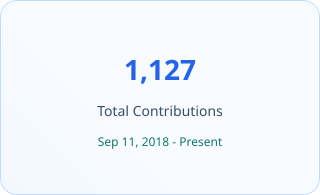

<!-- Profile README for https://github.com/code7cs -->

# Hey, I’m Hanfan 👋

### Senior full-stack engineer with deep frontend expertise.

I’m a senior full-stack engineer with 6+ years of experience building and evolving enterprise SaaS products. I work across the stack, with deepest expertise in React, Next.js, TypeScript, and Angular, plus hands-on experience building APIs, services, and data layers. I care about scalable architecture, accessibility, web performance, testing, and developer experience.

  

  
  

## What I care about

<table width="100%">
  <tr>
    <td width="33%" align="center" valign="middle">
      

        <h3>🧭 Clear architecture</h3>
        
Systems that stay understandable as products and teams grow.

      

    </td>
    <td width="33%" align="center" valign="middle">
      

        <h3>⚡ Product quality</h3>
        
Performance and accessibility treated as product features.

      

    </td>
    <td width="33%" align="center" valign="middle">
      

        <h3>🌱 Healthy teams</h3>
        
Mentoring, pragmatic standards, and decisions with context.

      

    </td>
  </tr>
</table>

## Tools I reach for

### Frontend

  &nbsp;
  &nbsp;
  &nbsp;
  &nbsp;
  &nbsp;
  &nbsp;
  &nbsp;
  

### Backend & data

  &nbsp;
  &nbsp;
  &nbsp;
  &nbsp;
  &nbsp;
  &nbsp;
  

### Platform & quality

  &nbsp;
  &nbsp;
  &nbsp;
  &nbsp;
  &nbsp;
  &nbsp;
  &nbsp;
  &nbsp;
  &nbsp;
  &nbsp;
  &nbsp;
  

## A little GitHub context

> Most of my recent work lives in private enterprise repositories. This profile is where I share smaller experiments and patterns I’m exploring in public.

---

Thanks for stopping by — let’s build something thoughtful.

